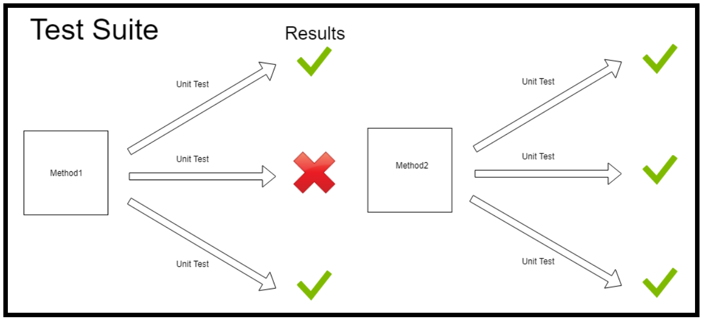

# APLICACIÓN DE UNITY TEST FRAMEWORK EN UN VIDEOJUEGO

> * GRUPO 6
>   * Ramón Arjona
>   * Nuria Bango
>   * Néstor Cabrero
>   * Pablo Martín
>   * Aaron Reboredo

## **UNITY TEST FRAMEWORK**
El **test de unidad** sirve (idealmente) para probar una "unidad de código. La definición exacta de “unidad” varía según el contexto, pero lo importante es tener en mente que un test de unidad debería estar probando solamente una “cosa” al mismo tiempo. Decimos que un método es **testeable** si realiza una sola “unidad” de trabajo. Los tests de unidad se basan en este concepto, habiendo un test por cada método testeable.

Cada test de unidad que se crea forma parte de una **suite**. Esta suite agrupa todos los test de unidad relacionados a un comportamiento lógico, y si un test individual perteneciente a una suite falla, la suite entera dará error.

**Unity Test Framework** (UTF), conocido anteriormente como Unity Test Runner, es una herramienta diseñada para testear código en varias plataformas. UTF es la herramienta que utiliza Unity para implementar test de unidad; **NUnit** es el framework open source de pruebas de unidad para Microsoft .NET y Mono (y, por tanto, Unity).

Los test de unidad son métodos, por lo que necesitan pertenecer a un **archivo de clase** para funcionar correctamente. UTF se encarga de pasar por todos los archivos de clases y ejecutar los tests de unidad. En este marco, los archivos de clase que contienen tests de unidad reciben el nombre de suite, y será donde dividamos la lógica de nuestras pruebas. La idea es dividir y agrupar los test en diferentes suites lógicas, dependiendo de lo que vayamos a estudiar en cada caso: físicas, movimiento, etc.

## **NUESTRO PROYECTO**

En nuestro proyecto final vamos a estudiar las posibilidades que ofrece Unity Test Framework y vamos a utilizarlo implementando en un videojuego varios test de unidad. El juego sobre el que vamos a realizar nuestro proyecto es **_Rat Harvest_**. En principio, utilizaremos la funcionalidad **PlayMode** de UTF, destinando los tests a **PC/Mac**, dado que son las plataformas en las que funciona el juego. Como el proyecto no incluye funcionalidades específicas para el editor de Unity, evitaremos utilizar UTF en su vertiente EditMode.

Para decidir nuestra aproximación final, a  continuación vamos a sopesar las ventajas e inconvenientes de implementar los test de unidad:

**Pros:**
-	Nos asegura que nuestro método funciona como esperamos.
-	Sirven como documentación para nuevas personas que tengan que aprender cómo funciona el código base.
-	Nos fuerza a escribir código que se pueda testear.
-	Nos ayuda a aislar bugs y arreglarlos más rápido.
-	Nos previene contra los bugs regresivos (nuevos bugs que pueden surgir de actualizar el código que ya estaba funcionando).

**Contras:**
-	Escribir tests puede llevar más tiempo que escribir el propio código.
-	Los tests malos o imprecisos generan una falsa confianza.
-	Implementarlos correctamente requiere de más conocimientos.
-	Puede haber partes importantes del código que no sean fácilmente testeables.
-	Algunos entornos de trabajo no permiten testing con métodos privados de una forma simple, lo que puede dificultar el proceso.
-	Si los tests son demasiados frágiles (fallan mucho por cosas que no deberían), el mantenimiento puede consumir mucho tiempo.
-	Los tests de unidad no detectan errores de integración
-	La IU es difícil de testear.
-	Los desarrolladores poco experimentados son propensos a malgastar tiempo testando cosas incorrectas.
-	El testing con dependencias de ejecución internas/externas puede ser complicado a veces.

Teniendo esto en cuenta, parece sensato aplicar los test de unidad tan solo a ciertos aspectos del juego. Cómo nos centraremos en implementar test de unidad a algún módulo concreto del juego, no nos pararemos a explorar la posibilidad de un **test de integración**, que requeriría más tiempo de planificación y trabajo. Habría sido interesante estudiar el desarrollo del juego si se hubiesen utilizado metodologías como TDD (Test Driven Development), pero igualmente se escapa a nuestras posibilidades. 

## **BIBLIOGRAFÍA**

https://docs.unity3d.com/Packages/com.unity.test-framework@1.1/manual/index.html

https://www.raywenderlich.com/9454-introduction-to-unity-unit-testing#toc-anchor-001

https://github.com/nunit/docs/wiki/NUnit-Documentation

